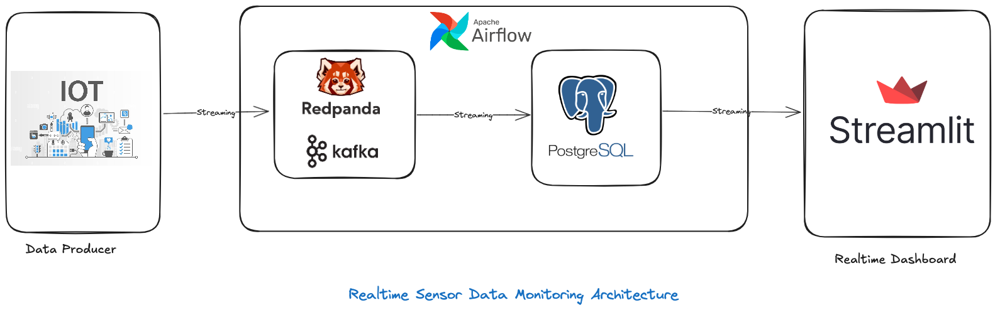

# **Real-Time Sensor Monitoring System**



A real-time sensor monitoring and alerting system built using **Redpanda (Kafka)**, **PostgreSQL**, **Airflow**, **Streamlit**, and **Docker Compose**. This project simulates sensor data, processes it in real time, detects malfunctions, and visualizes the results on a dynamic dashboard.

---

## **Table of Contents**
1. [Features](#features)
2. [Technologies Used](#technologies-used)
3. [Architecture Overview](#architecture-overview)
4. [Setup and Installation](#setup-and-installation)
5. [Usage](#usage)
6. [Project Structure](#project-structure)
7. [Screenshots](#screenshots)
8. [Future Improvements](#future-improvements)
9. [License](#license)

---

## **Features**
- **Sensor Data Simulation**: Generates realistic data for sensors, including temperature, humidity, and pressure.
- **Real-Time Processing**: Consumes and processes data using Redpanda (Kafka).
- **Database Storage**: Persists sensor data in a PostgreSQL database.
- **Anomaly Detection**: Identifies malfunctioning sensors based on predefined thresholds.
- **Dynamic Visualization**: Displays sensor data and alerts on a Streamlit dashboard.
- **Containerized Environment**: Simplified deployment with Docker Compose.

---

## **Technologies Used**
- **Python**: Core programming language for all components.
- **Redpanda (Kafka)**: For real-time data streaming and message processing.
- **PostgreSQL**: For persisting sensor data.
- **Airflow**: For orchestrating and managing tasks.
- **Streamlit**: For building the real-time dashboard.
- **Docker Compose**: For containerized deployment.

---

## **Architecture Overview**

1. **Sensor Data Simulation**:
   - A Python script generates data and produces it to a Redpanda topic.
   
2. **Redpanda (Kafka)**:
   - Acts as a message broker for real-time sensor data streams.

3. **PostgreSQL Database**:
   - Stores sensor data for historical analysis and dashboard visualization.

4. **Airflow**:
   - Orchestrates tasks such as creating the database schema and managing periodic jobs.

5. **Streamlit Dashboard**:
   - Displays sensor data, visualizations, and real-time alerts.

---

## **Setup and Installation**

### **Prerequisites**
Ensure you have the following installed:
- **Docker** and **Docker Compose**
- **Python 3.8+**
- **Git**

### **Clone the Repository**
```bash
git clone https://github.com/yourusername/realtime-sensor-monitoring.git
cd realtime-sensor-monitoring
touch .env # Add the ENV VARS
docker-compose up -d
streamlit run stramlit-app.py # Runs the dashboard
````

